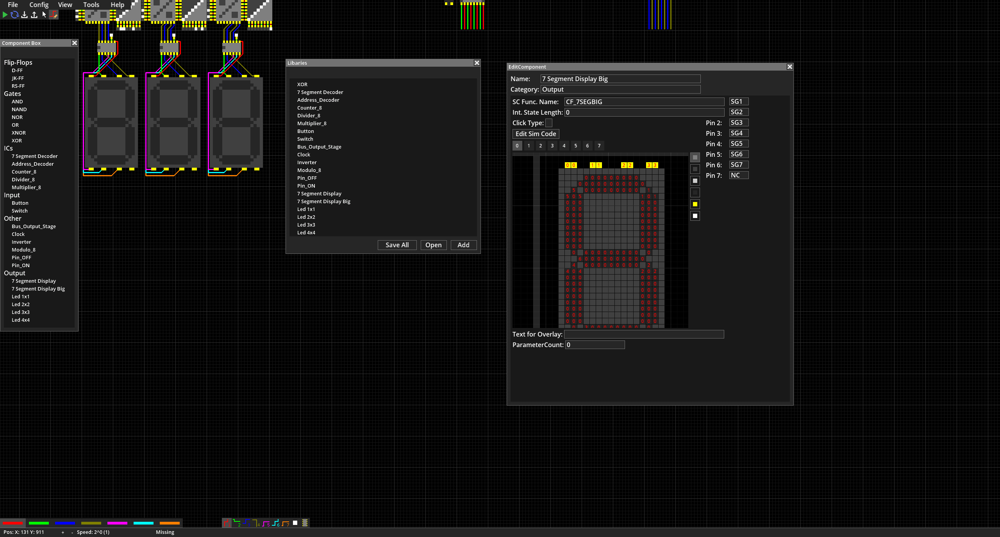
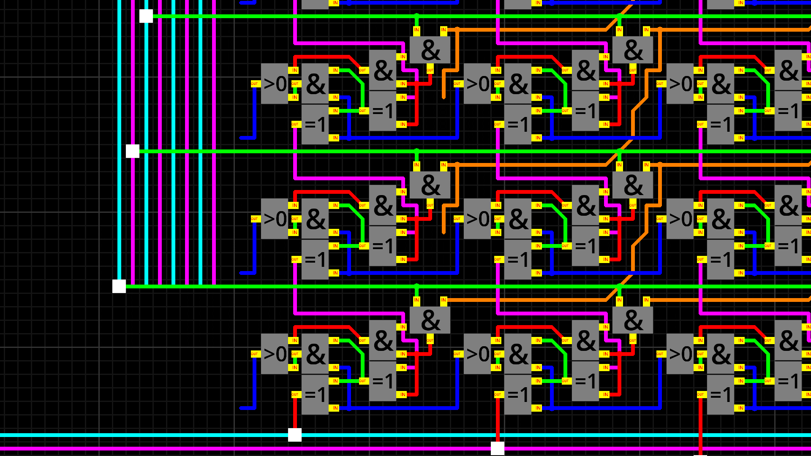
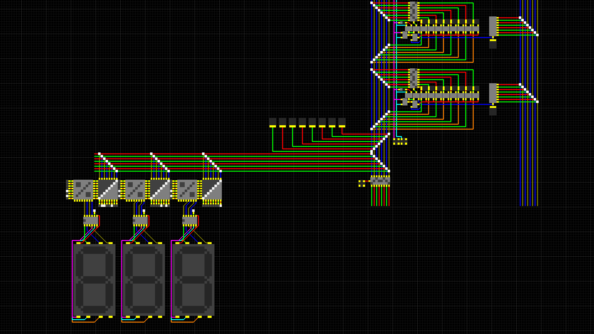

# Circuit Simulator

__Project creation date:__ 31.07.2019

## Description
This project is the diploma thesis developed by Marvin Ott and Alexander Schönhofer during the last year of the HTL.\
It features a digital circuit simulator with a fully functioning component editor.\
Special features of this circuit simulator:
* Main working grid with a maximum size of 16384 * 16384
* Components and wires are rendered through shaders which has the advantage that the amount of components and wires effect the rendering perfomance by almost nothing.
* Component editor through which all existing components can be fully edited and new ones can be created.
* The circuit simulation is done in C++ and each component has its own simulation code also in C++. The combined code gets compiled into a DLL thats used in the main application.

## Technologies
* C#, C++
* MonoGame

## Remarks
This project is quite heavy on RAM and especially VRAM of the GPU

## Pictures

***

***

